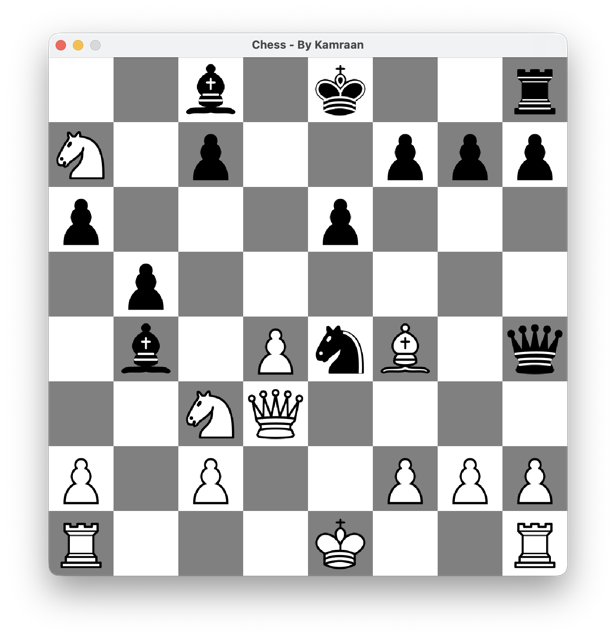
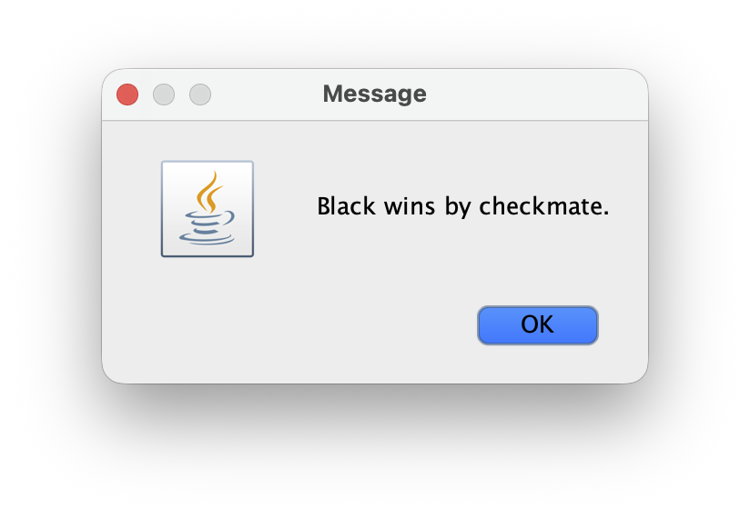

# Chess Engine

A simple Java chess project with a playable board UI and a basic computer opponent.

The game opens in a desktop window using Swing. You play as White, click a piece to see its legal moves, and the engine plays Black.

## Preview





## What this project has

- Java Swing board interface
- Move generation for all pieces
- Legal move checking
- Checkmate and stalemate detection
- Simple evaluation and search for the AI move

## Project structure

- `Main.java` starts the app
- `ui/` contains the window and board UI
- `models/` contains board, move, and piece data
- `engine/` contains move generation, evaluation, and search
- `assets/pieces_images/` contains the chess piece images

## Run the project

Compile:

```bash
javac Main.java
```

Run:

```bash
java Main
```
